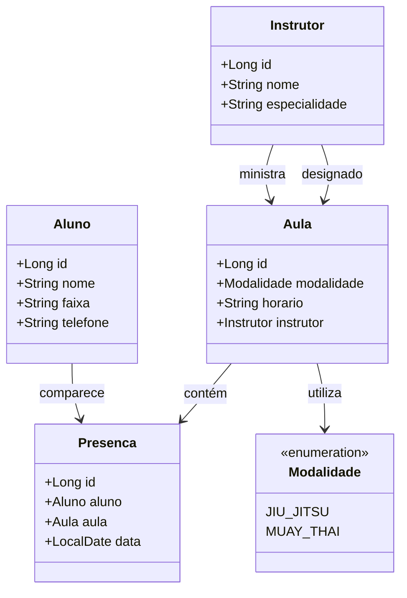
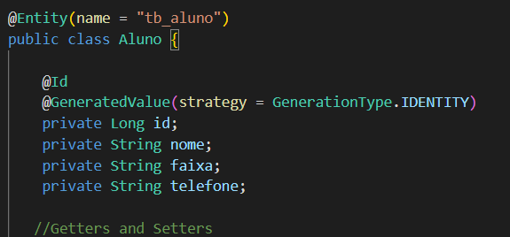
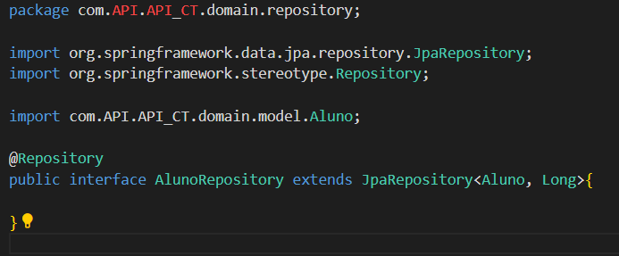
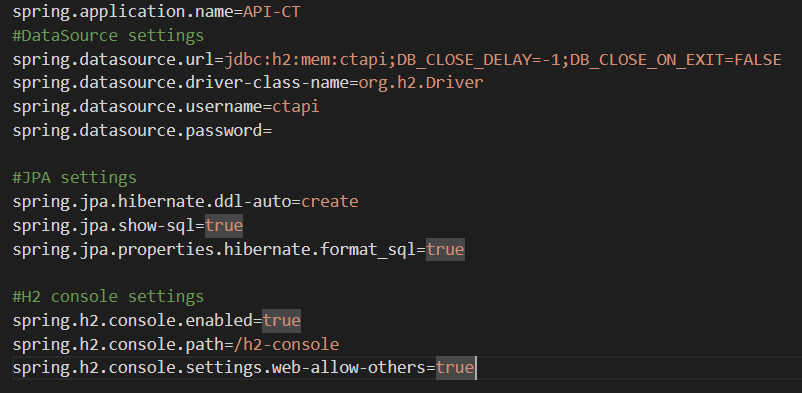
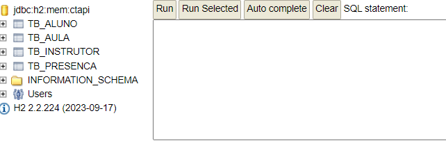
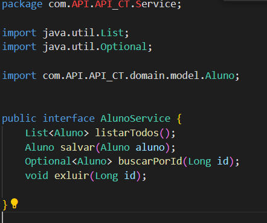
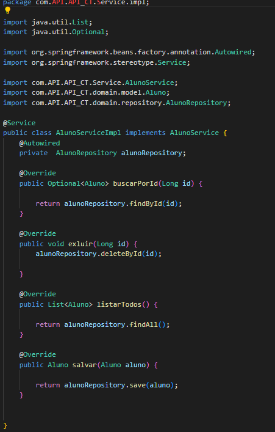
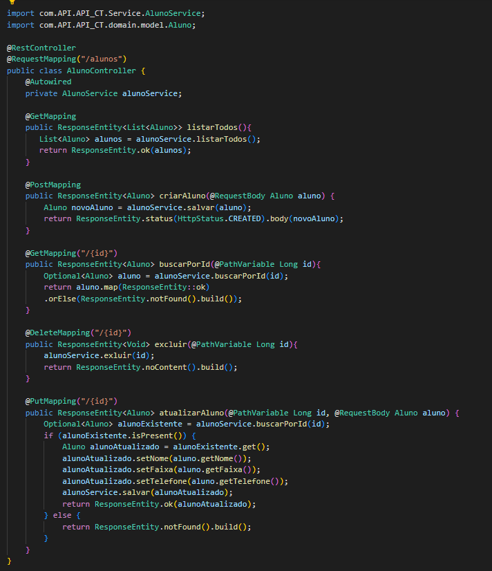
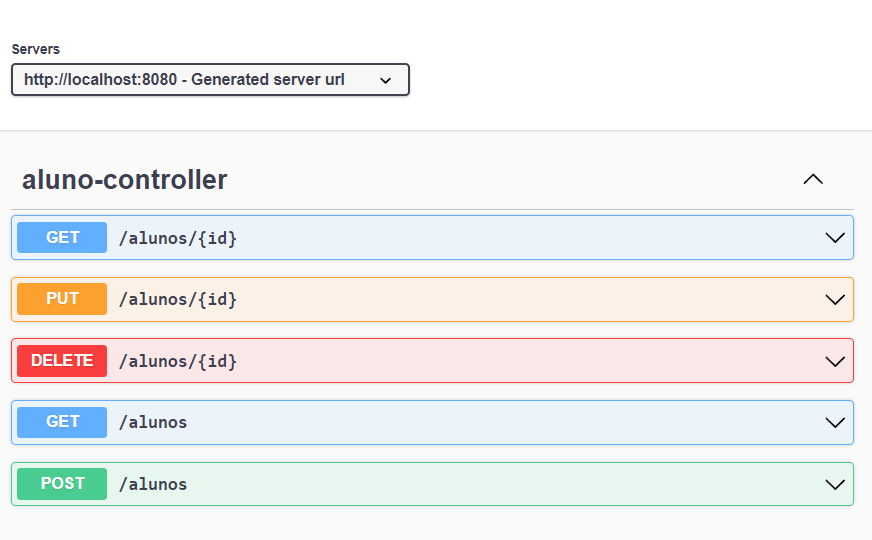

## API - Centro de treinamento
Para a construção da nossa API, vamos determinar as modalidades e as entidades:
 - Como modalidade teremos: Jiu Jitsu e Muay Thai.
 -  De entidades teremos: 
  Aluno,
  Instrutor,
  Aula,
  Presença.

Vamos criar então um esboço em JSON: 
```JSON
{
  "aluno": {
    "nome": "João Silva",
    "faixa": "Preta",
    "telefone": "82987872525"
  },
  "instrutor": {
    "nome": "Carlos Oliveira",
    "especialidade": "Jiu-Jitsu"
  },
  "aula": {
    "modalidade": "JIU_JITSU",
    "horario": "19:00",
    "instrutor": {
      "nome": "Carlos Oliveira",
      "especialidade": "Jiu-Jitsu"
    }
  },
  "presenca": {
    "aluno": {
      "nome": "João Silva",
      "faixa": "Preta",
      "telefone": "82987872525"
    },
    "aula": {
      "modalidade": "JIU_JITSU",
      "horario": "19:00",
      "instrutor": {
        "nome": "Carlos Oliveira",
        "especialidade": "Jiu-Jitsu"
      }
    },
    "data": "2024-08-09"
  }
}
 ```

Com base nesse JSON irei criar a diagramação de classes:


<h2>Configuração das entidades</h2>
 O próximo passo foi criar o pacote 'domain' com o pacote 'model' para os modelos das entidades:
 
 

 <h2>Criação dos repositórios</h2>
  Dentro do nosso pacote 'Domain' criei o pacote 'repository' com as configurações de armazenamento para cada entidade.



Em seguida configurar o banco de dados no 'application.properties'.



Feito isso, pude rodar a aplicação e ver se as tabelas foram criadas no banco de dados h2.
 Acessando a url (http://localhost:8080/h2-console) podemos vizualizar as tabelas:



<h2>Criação dos Serviços</h2>
 Serviços para encapsular a lógica de negócio e interagir com os repositórios:
   No pacote 'Service' crio as interfaces publicas de cada entidade:

   

  Ainda dentro da pasta, cria uma sub-pasta 'impl' que terá as implementações para cada interface de serviço: 

  

   - *Para que uma sub-pasta com implementações?* :
    
    - Organização: Separar as implementações das interfaces ajuda a manter o código organizado.
    - Modularidade: Facilita a troca de implementações se necessário, como por exemplo, criar uma nova versão de um serviço sem impactar o resto do código.
    - Manutenibilidade: Torna o projeto mais fácil de manter, especialmente em projetos maiores com muitas classes de serviço.


  <h2>Controllers </h2>

Criei a camada de controle, com os controladores REST para expor os endpoints da API. 


Com o controller criado, posso usar o Swagger para ver minha API documentada sem a necessidade de um Front-End: 

Ficou possivel observar os metodos: buscar, criar, deletar e atualizar. 