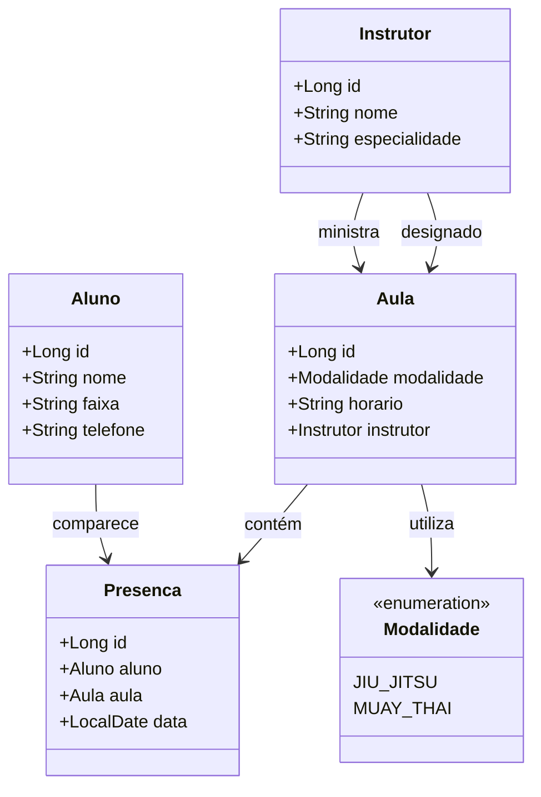

## API - Centro de treinamento
Para a construção da nossa API, vamos determinar as modalidades e as entidades:
 - Como modalidade teremos: Jiu Jitsu e Muay Thai.
 -  De entidades teremos: 
  Aluno,
  Instrutor,
  Aula,
  Presença.

Vamos criar então um esboço em JSON: 
```JSON
{
  "aluno": {
    "nome": "João Silva",
    "faixa": "Preta",
    "telefone": "82987872525"
  },
  "instrutor": {
    "nome": "Carlos Oliveira",
    "especialidade": "Jiu-Jitsu"
  },
  "aula": {
    "modalidade": "JIU_JITSU",
    "horario": "19:00",
    "instrutor": {
      "nome": "Carlos Oliveira",
      "especialidade": "Jiu-Jitsu"
    }
  },
  "presenca": {
    "aluno": {
      "nome": "João Silva",
      "faixa": "Preta",
      "telefone": "82987872525"
    },
    "aula": {
      "modalidade": "JIU_JITSU",
      "horario": "19:00",
      "instrutor": {
        "nome": "Carlos Oliveira",
        "especialidade": "Jiu-Jitsu"
      }
    },
    "data": "2024-08-09"
  }
}
 ```

Com base nesse JSON irei criar a diagramação de classes:

